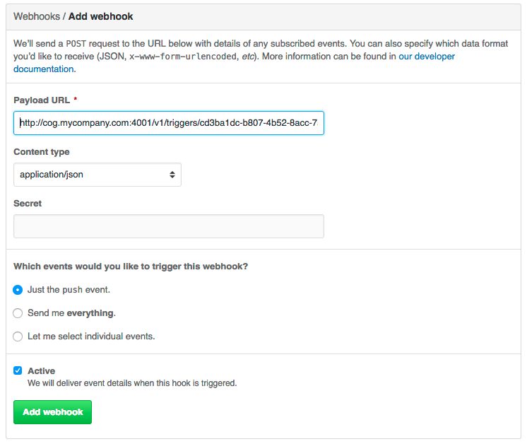

Developing a Trigger
====================

*Setting up Cog to respond to Github Webhooks*

You may have heard about Cog’s :doc:`triggers` and are curious
how you might use them in your Cog system. In this tutorial, we’ll set
up a Github webhook to trigger a Cog pipeline in order to explore
triggers in depth. Along the way, we’ll iteratively develop a pipeline,
pick up a few tricks about how to develop pipelines in Cog, and see how
to take maximum advantage of Cog’s composability and flexibility.

.. note:: | You can read up on the details of :doc:`Cog’s trigger
      system <triggers>`, but it isn’t necessary for this tutorial;
      we’ll explain "just enough" as we go along.
    | We’ll also provide links to more detailed documentation in
      callouts like this one throughout the tutorial.

At its most basic, a trigger is just a defined Cog pipeline that can run
in response to an HTTP request. This allows Cog to respond to events
outside of chat. In this tutorial, we’ll have Cog respond to Github
``push`` events to our favorite Github repository by notifying us in
chat. Yes, there are other ways of receiving simple notifications that
don’t require triggers, but we’ll soon see how our pipeline can be
expanded. Think of this as the "Hello World" of triggers.

Since triggers run a defined pipeline, we first need to define the
pipeline we want to run. For now, we’ll just hard-code the pipeline to
get something up and running, but later we’ll add in some variable
interpolation to do some more interesting things. Let’s just output the
message ``"Somebody pushed some code!"`` to our ``#engineering`` channel
in Slack:

**Cog.**

.. code:: text

    echo "Somebody pushed some code!" > chat://#engineering

You can run this directly in Slack and verify it works. If you’ve used
Cog before, you might notice the new :ref:`URL-style syntax for
redirects <chat_URLs>`. Adding ``chat://`` to the beginning of a
redirect will route output through the currently configured chat adapter
(Slack, Hipchat, IRC, etc.). Normally when you’re just interacting with
Cog through chat, this isn’t required since we default to returning
output back through adapter that received the request. That is, if you
typed a pipeline into Slack, Cog will send the output back to Slack.
However, our trigger will be coming from Github, and Github doesn’t know
how to access your ``#engineering`` channel! Our ``chat://`` destination
gives Cog a hint so it knows how to notify you and your colleagues when
interesting things happen.

.. note::
    -  :doc:`redirecting_pipeline_output`

    -  :ref:`redirect_destinations_in_triggered_pipelines`

Now that we know what pipeline we’re going to run, and determined where
the output is going to go, we need to set up the trigger to run it. With
the 0.4 release, we have a REST API for managing triggers, as well as
commands built into `cogctl <https://github.com/operable/cogctl>`__,
Cog’s command line interface; let’s use ``cogctl``:

**Creating a trigger.**

.. code:: shell

    cogctl trigger create 'github-alert' \
          'echo "Somebody pushed some code!" > chat://#engineering' \
          --enable \
          --description='Now you know when something happens on Github' \
          --as-user='bobby_tables' \
          --timeout=30

Here, we create a trigger named ``github-alert`` which runs the pipeline
we tested earlier. It’s a good idea to provide some documentation for
your trigger by adding a ``description``. Triggers *can* run as the Cog
user that makes the HTTP request if a Cog authentication token is
supplied in the ``authorization`` header, but we can also override that
by specifying a user that the pipeline will execute as. Here,
`bobby_tables <http://xkcd.com/327/>`__ will execute our pipeline.
Though the ``echo`` command we’re using doesn’t require any special
permissions, other commands may; in that case, you’ll want to be sure
that the user you specify has all the required permissions. Obviously,
``bobby_tables`` must exist in our Cog system
for any of this to work.

We also specify a timeout. Documentation for Github webhooks indicates
that Github expects a response within `30
seconds <https://developer.github.com/guides/best-practices-for-integrators/#favor-asynchronous-work-over-synchronous>`__
of webhook delivery. Other services may have different requirements. Cog
allows you to set this on a per-trigger basis as appropriate. Here,
we’ve specified a Github-recommended 30 seconds, even though 30 seconds
is the default.

We also specify, for completeness, that this trigger will be enabled,
though that is also the default. Enabled triggers are active and can be
run, while disabled triggers cannot.

.. note::

    -  :ref:`anatomy_of_a_trigger`

    -  :ref:`trigger_timeouts`

    -  :ref:`manipulating_triggers`

    -  :ref:`components_of_the_authorization_system`

Upon successful trigger creation, you can retrieve details about the
trigger with ``cogctl trigger info``.

**cogctl Output.**

.. code:: shell

    cogctl trigger info github-alert
    Name            github-alert
    Pipeline        echo "Somebody pushed some code!" > chat://#engineering
    Enabled         True
    As User         bobby_tables
    Timeout Sec     30
    Invocation URL  http://cog.mycompany.com:4001/v1/triggers/cd3ba1dc-b807-4b52-8acc-75c3f4e56b88

You’ll notice that the port on the invocation URL is different from the
one the rest of Cog’s REST API is served from. This is to allow
fine-tuning of firewall policies so you can restrict outside access to
just the pipeline triggers and not the entire Cog API.

We can actually test this out without Github just using something like
``curl``:

**Testing the trigger.**

.. code:: shell

    curl -X "POST" \
      "http://cog.mycompany.com:4001/v1/triggers/cd3ba1dc-b807-4b52-8acc-75c3f4e56b88" \
            -H "Content-Type: application/json" \
            -H "Accept: application/json" \
            -d "{}" \
      -i

If you run that, you’ll see something like this in your terminal:

**cURL Output.**

.. code:: text

    HTTP/1.1 204 No Content
    server: Cowboy
    date: Tue, 12 Apr 2016 19:07:25 GMT
    content-length: 0
    cache-control: max-age=0, private, must-revalidate
    x-request-id: cc2sl8bmhdjtutu9lloi6k10p5velb9v

i. and you should see something like this in your Slack client:

|marvin BOT 3:07 PM Somebody pushed some code!|

We can now take our invocation URL and use it at Github to set up a
webhook on our favorite repository; any time someone pushes code, we’ll
get notified by Cog!

|Add webhook dialogue|

.. note::
  -  :ref:`invoking_a_trigger`

Let’s Make It More Interesting
------------------------------

This is all well and good, but receiving the same message over and over
without any additional context is only going to succeed in making your
colleagues angry with you for crowding out all their cat GIFs with
``"Somebody pushed some code!"``. Let’s make our alerts more useful.

If you’ve ever used Github webhooks before, you know they send a
prodigious amount of data in their request bodies. Our initial pipeline
doesn’t do anything with this data, which seems like a waste; if we had
some way to get at that information, we could construct a *much* more
informative message. Fortunately, Cog makes this easy; in fact, the
request body, headers, and query parameters of a triggering HTTP request
are all made available to the command pipeline.

After looking at the `documentation for Github push
events <https://developer.github.com/v3/activity/events/types/#pushevent>`__,
we might come up with this as a more refined message to our
``#engineering`` chat channel:

**Cog.**

.. code:: text

    echo $body.pusher.name " just pushed code to " $body.ref " in " $body.repository.html_url ". Changes: " $body.compare > chat://#engineering

(That’s all a single line, by the way.)

Here ``body``, refers to the parsed JSON body of the incoming HTTP
request (you can also access ``headers`` and ``query_params``). You can
refer to arbitrary data within these maps using standard key paths and
array indexes. We can even "fake" this directly in chat to see how it
would behave by using the ``seed`` command to create some data that has
this shape:

**Cog.**

.. code:: text

    seed '{"body": {"pusher": {"name": "bobbytables"}, "ref": "refs/heads/master", "repository": {"html_url": "https://github.com/blahblah/blahblah-repo"}, "compare": "https://github.com/blahblah/blahblah-repo/compare/9049f1265b7d...0d1a26e67d8f"}}' | echo $body.pusher.name " just pushed code to " $body.ref " in " $body.repository.html_url ". Changes: " $body.compare > chat://#engineering

This is admittedly a bit long, but this is all one line that you can
paste into your chat client. Briefly, the ``seed`` command takes a JSON
string describing a map. It then passes this data to the following
command, which can then use variables to bind elements of that map to
option and argument values. Here, we’re simulating the small portion of
a Github webhook body that our pipeline cares about. A real Github
webhook request would naturally include much more information.

It works!

|marvin BOT 5:06 PM bobbytables just pushed code to /refs/heads/master
in
https://github.com/blahblah/blahblah-repo/compare/9049f1265b7d...0d1a26e67d8f|

.. note::
  -  :ref:`initial_calling_environment_for_trigger_invoked_pipelines`

Now that we’ve got a better pipeline, let’s update our existing trigger
using ``cogctl``:

.. code:: shell

    cogctl trigger update github-alert \
      --pipeline='echo $body.pusher.name " just pushed code to " $body.ref " in " $body.repository.html_url ". Changes: " $body.compare > chat://#engineering'
    ```

The ``trigger update`` command takes the trigger name as an argument,
as well as all the additional flags that ``trigger create`` takes; any
values you specify in an update command will overwrite the corresponding
values stored in the system.

At this point, the new pipeline is "live", and the next ``push`` event
from Github will result in a much more useful message in your chat room.

.. note::
  -  :ref:`update_a_trigger`

Going Further: Composability and Flexibility
--------------------------------------------

One of the fundamental principles of Cog is the "Unix philosophy" of
making tools that do one thing well, allowing users to join primitive
building blocks into larger constructs to get real work done. While
we’ve improved our triggered pipeline a great deal, it still has some
shortcomings. Next, we’ll see how we can improve the pipeline even more.
At the same time, we’ll show how Cog’s principle of simplicity allows
you to quickly build powerful pipelines.

Filtering
---------

Since we’re receiving Github ``push`` events, we’re actually getting an
event anytime anybody pushes to *any* branch in the repository.
Depending on your organization’s approach to ``git``, this could
translate to a *lot* of messages flooding your chat channel. This is
probably too much, particularly if you really only want widespread
visibility for pushes to the ``master`` branch. How can we ignore pushes
to other branches?

The good news is that the solution is already built into Cog. You don’t
have to write a new command to do this; you can just use Cog’s existing
``filter`` command! Looking again at the structure of the ``push``
event, it looks like we are interested in the ``ref`` field, which
indicates which branch code is being pushed to. In terms of Cog’s
packaging of request information, that translates to ``body.ref``. We
want to only allow processing to continue on push events where
``body.ref`` equals ``"refs/heads/master"``. That translates to the
following ``filter`` command:

**Cog.**

.. code:: text

    filter --path="body.ref" --matches="refs/heads/master"

Placing that at the beginning of our existing pipeline will get us what
we desire, with no extra code required. Any request that comes from the
``master`` branch will make it through the filter to the rest of the
pipeline. Requests from other branches will be filtered out, which
effectively halts pipeline processing, since there won’t be any data to
operate on.

Try updating the trigger pipeline using ``cogctl`` and try pushing to a
few branches; you’ll only see messages in chat for the master branch.

.. note::
  -  :ref:`errors_and_empty_pipelines`

Validation
----------

It’s a good practice to secure your webhooks when you can, and Github
provides an `easy
method <https://developer.github.com/webhooks/securing/>`__ to do so.
When you set up your webhook, you can also supply a "secret". Github
will then hash the body of the request with this secret and include the
checksum in the request as a header. On the receiving end, you can take
your secret, hash the body yourself, and compare the resulting checksum.
If it matches the value supplied in the header, you can be pretty
confident that it’s coming from Github.

In the interest of "doing one thing and doing it well", we haven’t baked
Github webhook validation into the core of Cog; that’s not Cog’s "one
thing". Conceptually, we’d like to have something like Cog’s ``filter``
command that would only let the pipeline proceed if the request can be
verified. Unfortunately, this is more than Cog’s ``filter`` command can
do. Fortunately, it’s not very difficult to create a command that can do
this. In fact, this short Ruby script will do the job.

.. code:: ruby

    #!/usr/bin/env ruby

    # github_verify.rb
    #
    # An implementation of Github webhook verification, as explained
    # at https://developer.github.com/webhooks/securing/, but for use
    # in Cog pipelines triggered via webhook.

    require 'json'
    require 'openssl'

    # Obtain the checksum from the webhook request header. All headers are
    # available from the command environment
    def signature(cog_env)
      header_value = cog_env["headers"]["x-hub-signature"]
      header_value.sub("sha1=", "")
    end

    # Compute our own checksum by hashing the raw body of the request with
    # our shared secret
    def compute_signature(cog_env, secret)
      body = cog_env["raw_body"]
      OpenSSL::HMAC.hexdigest(OpenSSL::Digest.new('sha1'), secret, body)
    end

    # Borrowed from Rack.Utils.secure_compare
    def secure_compare(a, b)
      return false unless a.bytesize == b.bytesize

      l = a.unpack("C*")

      r, i = 0, -1
      b.each_byte { |v| r |= v ^ l[i+=1] }
      r == 0
    end

    # Read the command environment from STDIN
    cog_env = JSON.parse(ARGF.read)

    # Obtain Github webhook shared secret set up by Cog's dynamic command
    # configuration
    secret = ENV['GITHUB_WEBHOOK_SECRET']

    # If GITHUB_WEBHOOK_SECRET isn't set log an error message and bail
    if secret == nil then
      STDERR.puts "Missing required environment variable $GITHUB_WEBHOOK_SECRET."
      exit 1
    end
    signature = signature(cog_env)
    computed = compute_signature(cog_env, secret)

    if secure_compare(signature, computed)
      # Our checksum matches Github's, so we'll simply pass all the data
      # we received downstream to the rest of our pipeline for processing
      STDOUT.puts "JSON"
      STDOUT.puts JSON.generate(cog_env)
    else
      # Something isn't right; the checksums don't match, so let's halt
      # pipeline processing now
      STDERR.puts "Signature does not match!"
      exit 1
    end

An in-depth discussion of how to write a command for Cog is outside the
scope of this tutorial, but hopefully this example illustrates that
there isn’t much to it; only a small amount of the code is specific to
Cog commands. The important thing to know is that all the request
information is provided as a JSON-encoded hash on ``STDIN`` (this is the
same structure we reach into when we bind option and argument values in
a Cog pipeline). We can reach into this hash to extract both the
Github-provided checksum, as well as the raw request body as a string
(Cog provides the raw body for this very use case).

We don’t want to hard-code our shared secret into this code. Instead we
can provide it in a configuration file on our Relay machine. Create the
file ``$RELAY_DYNAMIC_CONFIG_ROOT/github-trigger/config.yaml`` on your
Relay machine:

.. code:: YAML

    ---
    GITHUB_WEBHOOK_SECRET: "supersecretdonttellanybody"

Obviously, use your own secret, and don’t forget to add your secret to
your webhook’s configuration at Github:

|Webhooks/Manage webhook dialogue|

By providing a configuration file on our Relay with our shared secret,
Cog adds the secret to ``ENV`` when it calls the Ruby script. With this
last piece in place, we have all we need to verify that the request
indeed came from Github. If so, we’ll just pass all the request
information back out as JSON; if not, we’ll exit with a non-zero code to
halt the pipeline. Thus, this command acts like ``filter``, albeit a
filter that does a more involved check than a basic string comparison.

.. note::
    -  :doc:`dynamic_command_configuration`

    -  :ref:`relays_and_relay_groups`

For this tutorial, we’ve created a repository on Github that defines a
bundle with this command. It even defines a Docker image that can be
easily installed on your Relay instances to run in your own
infrastructure.

icon:github[2x]
`cog-bundles/github-trigger <https://github.com/cog-bundles/github-trigger>`__

This command bundle is defined by the following configuration file,
which is included in the ``github-trigger`` repository. Since this is a
Docker-based command bundle, this is really the only file you need to
install the bundle in your own infrastructure!

.. code:: YAML

    ---
    cog_bundle_version: 4

    name: github-trigger
    description: Interact with GitHub webhooks
    version: "0.1"
    docker:
      image: cogcmd/github-trigger
      tag: dev
    commands:
      verify:
        description: Verify a GitHub webhook body
        executable: "/usr/local/bin/github_verify.rb"

Assuming you have already set up a Relay instance and added it to a
Relay group named ``trigger-tutorial``, you can install this command
bundle in your own Cog instance:

.. code:: shell

    git clone https://github.com/cog-bundles/github-trigger.git
    cogctl bundle create ./github-trigger/config.yaml
    cogctl bundle enable github-trigger
    cogctl relay-group assign trigger-tutorial github-trigger

.. note::
    -  :doc:`managing_bundles`

    -  :ref:`installation_guide_bundle`

    -  :ref:`relays_and_relay_groups`

With this command in place, we can add verification to our existing
pipeline by simply placing ``github-trigger:verify`` as the first
command (I’ve broken up the individual invocations on separate lines for
readability):

.. code:: text

    github-trigger:verify |
    filter --path="body.ref" --matches="refs/heads/master" |
    echo $body.pusher.name " just pushed code to " $body.ref " in " $body.repository.html_url ". Changes: " $body.compare > chat://#engineering

You can update the trigger using ``cogctl trigger update`` as described
above. You can also construct inputs to verify this in pure chat using
the ``seed`` command, but that is left (as they say) as an exercise for
the reader.

Now if you trigger a webhook delivery, it will be verified! Try
experimenting by using the "wrong" shared secret (either on Github or in
your Relay configuration file; changes to either take effect immediately
and automatically) to confirm that invalid requests stop processing as
soon as they fail validation.

Conclusion
----------

We’ve covered a lot of ground in this tutorial! We’ve taken an in-depth
look at the new triggered pipeline feature of Cog and seen how we can
use it to kick off pipelines in response to incoming HTTP requests from
webhooks. We’ve also seen how to develop pipelines, how to extend
pipelines, and even how to create a custom command. Finally, we even got
a taste of the new Docker-based command bundles.

If you’re curious to learn more about the details of what’s happening
behind the scenes of this tutorial, please take a look at the various
documentation links scattered throughout. Also feel free to stop by our
`public Slack channel <https://cogbot.slack.com>`__ to say "Hi" and ask
whatever’s on your mind; we’d love to hear from you.

.. |marvin BOT 3:07 PM Somebody pushed some code!| image:: ../images/Slack_SomebodyPushedSomeCode.png

.. |marvin BOT 5:06 PM bobbytables just pushed code to /refs/heads/master in https://github.com/blahblah/blahblah-repo/compare/9049f1265b7d...0d1a26e67d8f| image:: ../images/seed.png
.. |Webhooks/Manage webhook dialogue| image:: ../images/webhook_secret.png
