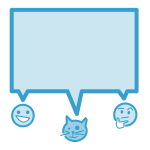

Introducing Cog
===============

**Cog** brings the power of the command line to the place you collaborate with your team all the time -- your chat window.

Powerful access control means you can collaborate around even the most sensitive tasks with confidence. A focus on extensibility and adaptability means that you can respond quickly to the unexpected, without your team losing visibility.

Current Features
================

Cog is under heavy development and getting smarter all the time. This list of features gives you an idea of how Cog was built as well as the things that Cog knows how to do.

.. image:: ../images/extensible.svg

Extensibility
-------------

Build new bot commands in any language

Commands return structured data to allow for creative adaptation in pipelines

Built in templating allows the command response to be formatted for the current chat provider without embedding markup in your logic

.. image:: ../images/adaptability.svg

Adaptability
------------
Unix-style pipelines allow you to combine a series of simple commands to solve complex, unexpected problems

Support for output redirection lets you make sure everyone is in the loop

Security
--------

Fine-grained command permissions give you confidence in using chatops for even the most sensitive workflows

Users, Groups, and Roles allow you to organize access control for ease of management

Audit logging for commands and administrative functions keep track of everything that happens with Cog

Chat-Provider Agnostic
----------------------

Current support for Slack and Hipchat

...other chat clients are on the roadmap!

Keep up to date on all things Cog by following `@Operable <https://twitter.com/operableinc>`_ on Twitter. Also, contact us at anytime via `info@operable.io <mailto:info@operable.io>`_.

Get Started
===========
Here are a few things you will need to do first.

- Join our public `Slack channel <http://slack.operable.io/>`_ to chat with the Operable team and the Cog community. This is the best place to get realtime help.
- Head over to the <<Installation Guide>> and start installing Cog. Have questions? Ask us!
- Once installed, make Cog do something. Read up on <<Commands and Bundles>>
- Do you want to expand Cog's command capabilities? Easy, start <<Building Command Bundles>>.
- Looking for Enterprise solutions like a fully integrated Cog,
  dedicated support, or consultation by our team? Read more on our `Enterprise page <https://operable.io/enterprise.html>`_.

Communication
=============
Let's set expectations. If you have a question, concern, idea, helpful hint, or want to tell us that you are hungry, we are listening. Please be as candid with us as possible. You can't hurt our feelings...too much. So that we can communicate as easily as possible we have several channels that you can use at anytime.

GitHub Issues
-------------
If you find an issue, please open an issue in Cog's `GitHub Repository <https://github.com/operable/cog/issues>`_

Cog Public Chat via Slack
-------------------------
Chat with Operable engineers and the growing community in our public `Slack channel <http://slack.operable.io>`_.

User experience feedback
========================
We want to know everything about how your experience with Cog is going. You cannot hurt our feelings! Tell us how we can make Cog a better ChatOps tool for you. Want to share your experience directly with someone at Operable? Find Shelton in `Slack <http://slack.operable.io>`_ and message him directly.
