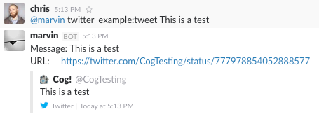
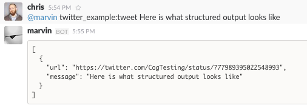
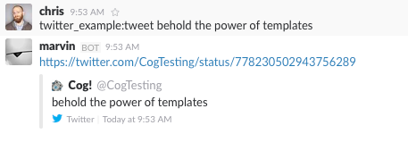
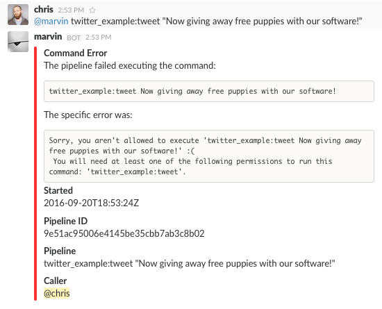
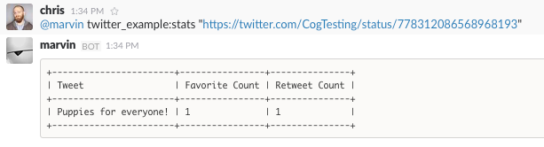
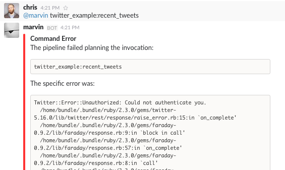
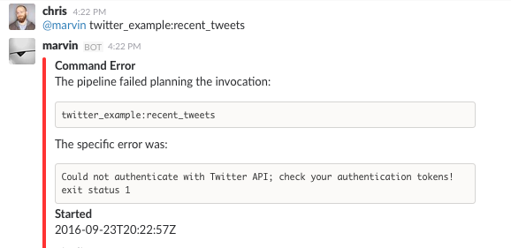

Writing A Command Bundle
========================

At some point in your use of Cog, you’ll want to write some command
bundles of your own. One of the promises of ChatOps is the ability to
bring your processes into the shared space of your chat system, lowering
the bar for collaboration, and increasing participation. Chances are
you’ve already got a number of programs and scripts that you already use
to run your systems. Fortunately, using those tools in Cog doesn’t
require shoe-horning them into a particular application framework, or
rewriting them into a new programming language. Instead, Cog’s interface
relies on the fundamental building blocks of standard input, standard
output, and environment variables.

In this chapter we’ll show you how to take a standalone program and
gradually write adapter code to make it interoperate with Cog. We’ll
examine Cog’s usage of input, output, and environment variables. We’ll
learn how to describe a bundle to Cog. We’ll also see how to package
your code and run it on Relay, Cog’s execution engine. Along the way,
we’ll also discover what is necessary if you’d like to write your own
language-specific interaction library to abstract the lower-level
details of the Cog - command interaction.

Our framework for examining all these points will be the creation of a
bundle that interacts with `Twitter <https://twitter.com>`__. For those
wanting to skip ahead, the "real" version of this bundle can be found in
Cog’s `Command Bundle
Warehouse <https://bundles.operable.io/bundles/twitter/latest>`__. This
chapter traces the techniques and thought processes a developer might go
through to arrive at that finished product.

.. warning::
    It is technically possible to write a Cog command in any language.
    However, certain languages are likely to provide poor performance
    due to particular details of their runtimes. You should generally
    favor languages that provide quick startup times. For example,
    commands written in JVM languages (Java, Clojure, Scala, etc.) will
    run slowly due to the relatively long startup of the Java Virtual
    Machine itself. This startup penalty will be incurred for each
    invocation of the command since Relay does not currently have a
    notion of a "persistent command", whereby a "warm" JVM could be kept
    around and shared for multiple invocations.

    At present, dynamic languages like Ruby and Python, or languages
    that compile down to performant executables, such as Go, Rust, etc.,
    will give you the best experience with Cog.

Scenario: Tweet from Cog
------------------------

Transparency during service incidents is essential to maintaining the
trust of your users. When your API slows down, you experience a hardware
failure, or have a service outage, your users will be affected. They
need to know that you are aware of the problem, and they need to know
that you’re working to remedy the situation.

`Twitter <https://twitter.com>`__ is a popular platform for companies to
quickly update their users on their system statuses. Wouldn’t it be nice
if you could easily send a tweet from your company’s status account from
your chat window as you and your colleagues work to remedy the
situation? The people closest to the situation could quickly get the
word out, without having to track down the person in the company that
has the account’s login information.

Let’s imagine what that might look like:

**Desired Interface for *twitter:tweet* Command.**

::

    @cog twitter:tweet Currently experiencing API slowdowns; investigating.

With a command like this, you and your colleagues could post status
updates directly from chat. Of course, it would be useful for more than
just status updates. For instance, you could also wire it up into
pipelines and triggers to augment other workflows; perhaps you could
automatically tweet when your CI system finishes a new product release?
The brave among you could even create an alias to "OH" your colleagues'
witty observations. Sending a tweet is a very simple task, but by adding
this simple task to Cog, you can unlock a number of incredibly useful
abilities. How much moreso with the more sophisticated tools you already
have?

Tweet from Plain Ruby
---------------------

The first thing we need to do before we can send a tweet from Cog is
figure out how to send a tweet, period. To make things easy, we’ll take
advantage of the ``twitter`` Ruby gem
(https://github.com/sferik/twitter) and build our solution on top of it.
The complete code is shown in :ref:`Command, Pure Ruby<pure-ruby-tweet>`.

.. note::
    For this example, we’re using Ruby for the heavy lifting of sending
    a tweet, but don’t be put off if you’re not a Ruby programmer.
    Thankfully, the code is short, and we’ll explain all the relevant
    points as we go on.

    Since you can write Cog commands in any language, though, the
    specific details of Ruby aren’t all that important. The key points
    to pay attention to are the details of how Cog interacts with this
    code.

.. note::
    If you’d like to follow along, you’ll need a Twitter account, as
    well as the required tokens to interact with the Twitter API. This
    will require creating an "application" under your account; go to
    https://apps.twitter.com to learn more. While you’re there, you’ll
    need to generate the following credentials:

    -  Consumer Key

    -  Consumer Secret

    -  Application Token

    -  Application Token Secret

.. _pure-ruby-tweet:

**tweet Command, Pure Ruby.**

.. code-block:: ruby
  :linenos:

    #!/usr/bin/env ruby

    require 'twitter'

    client = Twitter::REST::Client.new(
      consumer_key: ENV["TWITTER_CONSUMER_KEY"],
      consumer_secret: ENV["TWITTER_CONSUMER_SECRET"],
      access_token: ENV["TWITTER_ACCESS_TOKEN"],
      access_token_secret: ENV["TWITTER_ACCESS_TOKEN_SECRET"])

    message = ARGV.join(" ")

    tweet = client.update(message)

    puts <<-EOM
    Message: #{message}
    URL:     #{tweet.url}
    EOM

**Annotations by line number:**

**Line 5** Here, we establish a connection to the Twitter API, using our API credentials, stored as environment variables.

**Line 11** Next, we’ll assemble a message to send by combining all the command line arguments into a single string. This allows us to invoke our command like ``twitter:tweet this is a tweet``, or ``twitter:tweet "this is a tweet"``. The former is often more convenient, but the latter is needed when the message contains special characters, like ``!``.

**Line 13** Here, we actually send the message to Twitter.

**Line 15** Finally, we’ll return some information to standard output so we can
find out the URL of our new tweet. There is other information we
could add (like timestamp, tweet ID, etc.), but for now, we’ll keep it simple.

To make life easier, let’s create a ``Gemfile`` in our directory to
manage our dependencies. We’ll also use this later when we package our
bundle up.

**Twitter Bundle Gemfile.**

.. code:: ruby

    source 'https://rubygems.org'

    gem 'twitter'

As you can see, it’s not a lot of code, and we can run it directly from
our terminal, as seen in :ref:`Executing the Pure Ruby tweet<execute-pure-ruby-tweet>`.

.. _execute-pure-ruby-tweet:

**Executing the Pure Ruby ``tweet`` Command.**

.. code-block:: bash
  :linenos:

    bundle install
    export TWITTER_CONSUMER_KEY=XXXX
    export TWITTER_CONSUMER_SECRET=XXXX
    export TWITTER_ACCESS_TOKEN=XXXX
    export TWITTER_ACCESS_TOKEN_SECRET=XXXX
    ./tweet.rb This is an interesting tweet

Outputs:

.. code-block:: console

    Message: This is an interesting tweet
    URL:     https://twitter.com/CogTesting/status/776507696396791809

**Annotations by line number:**

**Line 1** We only need to install our dependencies once. Note also that ``bundle`` here refers to the Ruby dependency management tool `Bundler <https://bundler.io>`__, and not any Cog-specific executables. We’re not even using Cog yet!

**Line 2** Substituting the appropriate values for our real credentials, of course.

By checking that URL, we can further verify that our command worked.

.. figure:: ../images/first_tweet.png
   :alt: Our First Tweet

   Our First Tweet

We now have a simple program to send a tweet, but we haven’t touched Cog
just yet; we’ll begin to do that now.

First Steps Toward Cog: Arguments
---------------------------------

Our tweet code is simple, and so getting it to run in Cog should also be
pretty simple. With the code we have, we’ll need to take care of two
things: arguments and our authentication tokens. We’ll tackle arguments
first.

Recall our desired interface for our ``tweet`` command:

::

    @cog twitter:tweet Currently experiencing API slowdowns; investigating

The string ``twitter:tweet`` is the name of our command, and everything
that follows is the message we’d like to send. If this were a
traditional terminal program, each word after ``twitter:tweet`` would be
an individual argument ("Currently", "experiencing", "API", etc.). As
Cog commands are heavily influenced by the idioms and architecture of
the UNIX command line, it should come as no surprise to know that Cog
views these as arguments, as well.

In fact, if you have ever programmed in C before, the environment
variables Cog uses to represent these arguments will look familiar.

-  ``COG_ARGC`` - **COG ARG**\ ument **C**\ ount = how many arguments
   were passed

-  ``COG_ARGV_0`` - **COG ARG**\ ument **0** = the first argument

-  ``COG_ARGV_1`` - **COG ARG**\ ument **1** = the second argument

and so on.

Using the values of these environment variables, a command can
reconstruct the arguments in whatever form is most natural for its
implementation language (e.g., as an array, a vector, etc.). Though it’s
not hard to write that code, it can be tedious to do it more than once;
this is where the use of language-specific libraries can be useful;
we’ll take a look at ``cog-rb``, the Ruby library for Cog commands a bit
later.

There are two approaches we can take to get these Cog environment
variable consumed properly by our code. We could edit our Ruby code to
directly interface with Cog, assembling the message from the
``COG_ARG_*`` variables instead of from ``ARGV``. Alternatively, we
could put this logic into an adapter script that translates between the
interfaces of Cog and our tweet program. The former approach may be more
useful for very small or simple programs that will only be used via Cog,
while the latter can be more desirable for larger and more complex
programs, programs where the source code is not readily accessible, or
for programs that still need to be usable outside of a Cog context (see
:ref:`Tip: Advantages of Adapters<advantages-of-adapters>` for more on this).

As the adapter script approach is more flexible and more clearly
illustrates the underlying mechanics of the Cog interface, that is the
approach we’ll take now. Let’s pretend that ``tweet.rb`` is a program
that we have been using for years in our company, and that we would now
like to interface with Cog, without rewriting it.

(Later in the chapter, once we’ve gotten a better feel for how Cog
commands work, we’ll add another command using the more direct
approach.)

For the time being, we’ll continue to run our command directly in a
terminal, and not through Cog. This will allow us to focus on only the
Cog / command interface, without also having to introduce command bundle
packaging, bundle installation, and other details. We will, of course,
introduce all those concepts and more in time, but for now, the
following code *is* Cog to our nascent command.

.. _run-tweet-command-from-command-line:

**Run Our Command from the Command Line.**

.. code-block:: bash
    :linenos:

    export TWITTER_CONSUMER_KEY=XXXX
    export TWITTER_CONSUMER_SECRET=XXXX
    export TWITTER_ACCESS_TOKEN=XXXX
    export TWITTER_ACCESS_TOKEN_SECRET=XXXX

    export COG_ARGC="2"
    export COG_ARGV_0="Hello"
    export COG_ARGV_1="World"

    ./tweet_cog_wrapper.sh

**Annotations by line number:**

**Line 6**  Here, we introduce Cog’s environment variables into our runner
script. This would correspond to ``@cog twitter:tweet Hello World``
in our chat provider. Cog will parse the ``Hello World`` message as
two separate arguments.

**Line 10** Instead of calling our Ruby code directly, we introduce a new adapter
script to process the Cog environment variables.

Our Cog command is shown in :ref:`tweet\_cog\_wrapper.sh<tweet-cog-wrapper>`
Remember, this is acting as an adapter that allows us to call our
original ``tweet.rb`` script from Cog. We are not changing ``tweet.rb``
at all. This adapter script is the only thing that is aware of Cog.

.. _tweet-cog-wrapper:

**tweet\_cog\_wrapper.sh.**

.. code-block:: bash
    :linenos:

    #!/bin/bash

    declare -a ARGUMENTS
    for ((i=0;i<${COG_ARGC};i++)); do
        var="COG_ARGV_${i}"
        ARGUMENTS[$i]=${!var}
    done

    ./tweet.rb ${ARGUMENTS[*]}

**Annotations by line number:**

**Line 3** We need to pull out the ``COG_ARGV_*`` variables to pass as actual
arguments to our Ruby script. Here, we loop as determined by the
``COG_ARGC`` variable, placing each ``COG_ARGV_*`` variable into a Bash array in turn.

**Line 9** With the pieces of our message extracted from the environment, we can
now call our Ruby script just as we have previously, passing the
arguments as actual arguments. Compare this to the invocation of
``tweet.rb`` in :ref:`Executing the Pure Ruby tweet<execute-pure-ruby-tweet>`.

When we execute our command in the terminal, it works as expected.

   Hello World

Believe it or not, we’re now ready to start packing this up for Cog.
There’s more to Cog commands than arguments, of course, but we’re now at
a point where we can actually run what we have in Cog!

.. tip::
    In :ref:`Run Our Command from the Command Line<run-tweet-command-from-command-line>`, you
    might have wondered why Cog would go to the trouble of turning the
    arguments

    ::

        hello world

    into the environment variables

    ::

        COG_ARGC=2
        COG_ARG_0=hello
        COG_ARG_1=world

    only to have our command turn those environment variables *back*
    into arguments that our Ruby code can process.

    While each computer language has its own conventions and idioms,
    they *all* have ways to read environment variables (and consume
    standard input and write to standard output, which we’ll address
    soon.) By basing its interaction model on universal components like
    environment variables, Cog places no restrictions on what language
    commands are written in. There are no "blessed" languages for Cog
    commands; you can write commands in Fortran, COBOL, or Forth just as
    readily as you can in Ruby or Python. It is completely transparent
    to Cog.

.. _advantages-of-adapters:

.. tip::
    Earlier, we briefly mentioned some reasons why you might want to
    write an adapter script to interface Cog with existing tools you may
    already use. We’ll examine some of those reasons more in depth here.
    These reasons are not mutually exclusive; more than one may be
    applicable in any given situation.

    -  Proper Separation of Concerns

    If you have code that already performs a task well, editing it to
    also become aware of Cog calling conventions can violate the Single
    Responsibility Principle and make the code more complex and harder
    to maintain. Isolating the Cog interaction in an adapter can yield
    software that is easier to maintain and test.

    -  Source Code is Not Required

    You may wish to expose some software to Cog that you either do not
    have the source code for, or for which altering the source code may
    be impractical. By using an adapter, you can control how the
    executable is called.

    -  Tools Must Remain Usable Outside of Cog

    Some tools that you wish to use with Cog may also need to be usable
    outside of Cog. In this case, changing the code to use Cog’s calling
    conventions may make use outside of Cog inconvenient and unwieldy
    (imagine invoking such a command with four arguments, for instance).
    Using an adapter allows Cog to call it, but also retains the more
    familiar calling interface for existing users of the tools.

    -  Limit Capabilities Exposed to Chat

    You may have existing tools with some features you would like to use
    in chat, but others that are perhaps too dangerous, inapplicable, or
    inappropriate for a chat context. By using an adapter, you can limit
    what capabilities are made available to Cog.

Describe it to Cog: Bundle Definitions
--------------------------------------

All Cog commands reside in a **bundle**, which is a collection of
related commands, along with metadata describing them. Right now, we
have the makings of a single-command bundle.

All bundles are described by a YAML file, which gives Cog all the
information it needs to properly interact with their commands. Let’s
take a look at a minimal bundle definition file for our new ``twitter``
bundle.

.. tip::
    Bundle definition files are conventionally named ``config.yaml``;
    the actual name is irrelevant to Cog, however.

**Minimal ``config.yaml`` Bundle Definition.**

.. code-block:: yaml
    :linenos:

    ---
    cog_bundle_version: 4

    name: twitter_example
    description: Interact with Twitter
    version: 0.0.1
    commands:
      tweet:
        description: Send a tweet!
        executable: /Users/chris/cog-book/tweet_cog_wrapper.sh
        arguments: "<message>"
        rules:
          - allow

**Annotations by line number:**

**Line 2** Every bundle must declare which bundle definition schema version it
uses. This determines which fields are expected, how their values are
validated, and so on. At the time of writing, the current version is
``4``.

**Line 3** Every bundle must have a name. These must be unique within a Cog
installation.

**Line 4** While not strictly required, it is a good practice to include a brief
description of the bundle. This will be displayed when listing
bundles that are installed on a Cog system, helping users discover
which commmands are available.

**Line 5** This version pertains to the bundle definition artifact itself.
Multiple versions of a bundle may be installed on a Cog system at one
time, though only one may be active.

**Line 6** In order for Cog to recognize a command, it must be described here in
the ``commands`` section. The keys of this map are the command names,
and the values are objects providing metadata about the command.

**Line 9** The path to the actual program that contains the command logic. This
is what we are writing!

**Line 10** Though not required, describing the inputs your command takes is
always a good idea.

**Line 12** Cog has a comprehensive authorization system that allows you to
define rules that govern who may execute a command. We’ll explore
this further in a bit, but for now, just remember that the special
``allow`` rule means that any Cog user will be able to execute this
command.

Now that we’ve described our bundle, we need to upload this definition
file to Cog.

Installing the Bundle
---------------------

Once we have written bundle definition file, we need to load it into
Cog. We’ll use ``cogctl``:

**Installing a Bundle: The Quick Way.**

.. code-block:: bash

    cogctl bundle install config.yaml --enable --relay-group=default

Here, we do several things at once. First, we upload the contents of our
bundle definition to Cog. By adding the ``--enable`` flag, we also make
the described bundle active. Cog will accept invocations for commands
within the bundle and attempt to dispatch them; additionally, if any
other versions of this bundle were previously available and enabled,
this would ensure that the version we just uploaded was the active one.
Finally, we associate the bundle with one or more relay groups, which
governs which Relay servers will be responsible for satisfying requests
targeted at this bundle.

This is equivalent to:

**Installing a Bundle: The Verbose Way.**

.. code-block:: bash

    cogctl bundle install config.yaml
    cogctl bundle enable twitter_example 0.0.1
    cogctl relay-group assign default twitter_example

If you look back at our bundle definition, you’ll notice that the path
to the executable is on my workstation. When a Relay gets the request to
run the command, it will look at this path, which means that we’ll need
to ensure that the Relay has all the requisite files installed before a
command will actually execute. For the purposes of demonstration, we’ll
be running a Relay on the workstation, but for real world usage, you’ll
want to take measures to install the needed files in the correct place.
Tools like `Chef <https://chef.io>`__, `Puppet <https://puppet.com>`__,
or `Ansible <https://www.ansible.com>`__ can help with this.

TODO: Need to better describe a bundle development setup, either with a
Relay running locally, or with a Relay running in Docker.

TODO: I wanted to illustrate that a "native" bundle is possible, and
possibly emphasize the "changes are live immediately" aspect of this.
The new dev mode on Relay may make this more of a moot point, though.

In a bit we’ll update our bundle to use Docker, which greatly simplifies
bundle installation and maintenance.

TODO: Additional docs about how to start Cog, Relay, etc.

Once the bundle is installed, we can finally run it from chat!

.. figure:: ../images/tweet_minimal_bundle_failure.png
   :alt: First Time Running the ``tweet`` Command from Cog

   First Time Running the ``tweet`` Command from Cog

Oh no! It looks like we can’t authenticate with Twitter. But we’ve still
got our credentials in the environment, don’t we?

Dynamic Configuration
---------------------

Actually, we *don’t* have our credentials in the environment anymore,
mainly because we’re now running the command under Relay and not our
runner script. When a command is executed by Relay, it injects variables
into the environment that each command receives. This is how
``COG_ARGC``, ``COG_ARGV_0``, etc. get into place. Relay can also be
configured to inject additional arbitrary values into the environment as
well, but these will be *global*, applying to every single command
invocation that Relay services. While you *could* add the variables our
``tweet`` command is expecting to your Relay configuration, this would
create a huge security hole; every command would have access to your
Twitter credentials! Over time, this approach would also become rather
difficult to maintain as you added more bundles. Adding environment
variables like this to your global Relay configuration is a Really Bad
Idea, and we shall speak of it no further.

.. tip::
    We’ve established that adding environment variables containing
    authentication tokens, passwords, and other secrets that individual
    commands need to Relay’s global configuration is a bad idea. Any
    variables you add to this configuration should genuinely be global.
    Some examples include ensure that certain supporting files are
    available on the ``PATH``, or that necessary libraries are on the
    search paths of whatever language runtimes you might be using.

Instead, we’ll let Cog manage these environment variables for us. This
way, the only commands that will get our Twitter authentication tokens
will be commands in our ``twitter_example`` bundle. We can also quickly
change the values centrally in Cog, and they will take effect across all
Relays almost instantly. We can even create "layered" configurations,
dynamically changing the values based on the user that invokes a
command, the chat room from which they invoke it, or a combination of
both. For now, though, we’ll just deal with the simple case.

Let’s create another YAML file to contain your environment variables
(substituting ``XXXX`` with your real tokens, of course):

**Dynamic Configuration.**

.. code:: yaml

    ---
    TWITTER_CONSUMER_KEY: XXXX
    TWITTER_CONSUMER_SECRET: XXXX
    TWITTER_ACCESS_TOKEN: XXXX
    TWITTER_ACCESS_TOKEN_SECRET: XXXX

TODO: Need to mention starting up Relay in managed config mode here.

This file is a simple map whose keys are the environment variable names
that the command expects (compare these to our original ``tweet.rb``
file), and whose values are the, well, values those variables should
have. Remember that the values will be presented to your code as strings
(like all environment variables); if your code expects different data
types (integers, floats, booleans, etc.), you’ll need to handle that
translation on your own (though this is another thing that
language-specific libraries could potentially handle for you).

Uploading this file to Cog requires another ``cogctl`` invocation.

**Uploading Dynamic Configuration to Cog.**

.. code-block:: bash

    cogctl bundle config create twitter_example dynamic_configuration.yaml

Now, we should be able to run our command completely within Cog.

   Successful Execution of the ``tweet`` Command from Cog

Success! Cog has captured the output of our tweet command and presented
it it in our chat client (Here, we’re using Slack; the fancy tweet
display is due to Slack’s handling of URLs, and is not something
specific to Cog).

We could declare victory here, but Cog can do more than just parrot
standard output back to chat. If we structure the output our command
returns to Cog, we can unlock richer output formatting, as well as make
the output more easily accessible to any downstream commands in a
pipeline.

Output
------

As we saw above, the standard output of a command gets returned back to
Cog and output in chat. Pipelines and most templates in Cog act on JSON
object inputs, though, not arbitrary text like traditional Unix
pipelines do. By structuring the output a bit, we can make our data much
more useful.

Let’s update our adapter script to generate structured output.

**tweet\_cog\_wrapper.sh with structured output.**

.. code-block:: bash
    :linenos:

    #!/bin/bash

    declare -a TWEET_ARGUMENTS
    for ((i=0;i<${COG_ARGC};i++)); do
        var="COG_ARGV_${i}"
        TWEET_ARGUMENTS[$i]=${!var}
    done

    output=$(bundle exec $(dirname ${0})/tweet.rb ${TWEET_ARGUMENTS[*]})

    message=$(echo "$output" | grep "Message: " | cut -d":" -f2 | sed -e 's/^ *//')
    url=$(echo "$output" | grep "URL: " | sed -e 's/^URL: *//')

    echo "JSON"
    echo "{\"message\": \"${message}\", \"url\": \"${url}\"}"

**Annotations by line number:**

**Line 9** Instead of returning the standard output directly to Cog, we’ll
capture it in our adapter script to perform some post-processing.

**Line 11** Here, we use common Unix utilities to extract our tweet message and
URL from the output. You can use whatever tools you like for this.

**Line 14** If the output contains the string ``"JSON"`` on a line by itself,
followed by a newline, the remainder of the output is treated as
JSON. Here, we manually create a JSON version of the plain text
output we were originally returning. Of course, you can generate JSON
in any number of ways; we’re taking the manual route here for
demonstration purposes, and because the object itself is so simple.

The ``JSON`` tag in our output is a "command response attribute", one of
several that can be used by commands. We’ll touch on a few more in this
chapter; for more details, see :doc:`../references/command_output_tags`. The
upshot is that when Relay detects these response attributes in a
command’s output, it interprets them as special instructions on how to
handle that output. The ``JSON`` tag is probably the most commonly used
one.

Now, when we run our command through Cog, our output looks very
different.

   Structured Command Output

We now see a pretty-printed version of our JSON in chat. Because we’ve
added structure, downstream commands can use our output, like so:

.. _simple-echo-pipeline:

.. figure:: ../images/tweet_structured_output_pipeline.png
   :alt: Extracting Data from Structured Command Output

   Extracting Data from Structured Command Output

Templating Output
~~~~~~~~~~~~~~~~~

As interesting as pretty-printed JSON output is, it can be cumbersome to
deal with in chat. Though this particular command’s output is not so
bad, imagine dealing with a large JSON object with 50 keys and
non-scalar values. It would be difficult to visually parse, and the size
of it alone would obscure the actual human conversations happening,
largely nullifying the benefits of "doing chatops" in the first place.
Favoring more complete outputs is good for maximum flexibility in
pipelines, but humans rarely need to see all that data to get the
situational awareness they need.

In order to address this, Cog commands can specify that their output be
rendered through a template, allowing Cog to present the most salient
information to humans, formatted by the conventions of your chat client.
Cog templates are written using
`Greenbar <https://github.com/operable/greenbar>`__, a templating
language written by Operable to satisfy the needs of Cog. It’s probably
best described as a Markdown variant with support for ERB-like tags.

The time has come to add a template to our bundle. Here is what ours
will look like:

**Greenbar ``tweet`` Template.**

::

    ~each var=$results~
    ~$item.url~
    ~end~

TODO: why iterate over $results?

Given what we saw in the output before, we probably really only care
about the new tweet’s URL. Modern chat platforms will generally display
the tweet for us based on that URL, and in any event, you can always
click that URL if you want to see the tweet. Our template here simply
extracts the URL from the JSON object our command now returns.

.. note::
    Templates are only used for formatting the final output of a
    pipeline for human consumption. If a command is not the last one in
    a pipeline, any template information is ignored. Templates *do not*
    "filter" the output as it flows through a pipeline.

To make the template available to Cog, we must add it to our bundle
definition file.

**Adding Templates to the Bundle Definition.**

.. code-block:: yaml
    :linenos:

    ---
    cog_bundle_version: 4

    name: twitter_example
    description: Interact with Twitter
    version: 0.0.2
    commands:
      tweet:
        description: Send a tweet!
        executable: /Users/chris/cog-book/tweet_cog_wrapper.sh
        arguments: "<message>"
        rules: [ 'allow' ]
    templates:
      tweet:
        body: |
          ~each var=$results~
          ~$item.url~
          ~end~

**Annotations by line number:**

**Line 5** Note that we have updated the version of the bundle. You must do this
if you want to upload a new definition with a new template, new
command, or otherwise altered metadata.

**Line 12** Here we have a new top-level section of the bundle: ``templates``.
The keys of this map are the names of templates, while the values are
objects whose ``body`` key stores the literal text of the template.

Once we install this bundle there’s one more modification we must make
to our adapter script. We must somehow inform Cog which template it
should use to format the output of the command. The solution is similar
to how we instructed Cog to treat our output as JSON: we’ll use a
command response attribute.

**Specifying a Template in a Command.**

.. code-block:: bash
    :linenos:

    #!/bin/bash

    declare -a TWEET_ARGUMENTS
    for ((i=0;i<${COG_ARGC};i++)); do
        var="COG_ARGV_${i}"
        TWEET_ARGUMENTS[$i]=${!var}
    done

    output=$(bundle exec $(dirname ${0})/tweet.rb ${TWEET_ARGUMENTS[*]})

    message=$(echo "$output" | grep "Message: " | cut -d":" -f2 | sed -e 's/^ *//')
    url=$(echo "$output" | grep "URL: " | sed -e 's/^URL: *//')

    echo "COG_TEMPLATE: tweet"
    echo "JSON"
    echo "{\"message\": \"${message}\", \"url\": \"${url}\"}"

**Annotation by Line Numbers:**

**Line 14** An output line that begins with ``COG_TEMPLATE:`` is a special
command response attribute; whatever follows on that line is the name
of a template *in that command’s bundle* that should be used for
formatting. Our template is called "tweet", as defined in our bundle
definition YAML ``templates`` section.

Bundles may include many templates, and since a command programmatically
indicates which template to use, any single command may actually use
more than one template (e.g., based on the result of this invocation,
use template ``x``, but use template ``y`` if some other result is
generated). For any given output, however, only one template may be
used.

Running the command again in our chat client shows us the template in
action.

   Output Formatted with a Simple Template

Here we see the output from Cog is just the tweet’s URL, and not raw
JSON.

.. note::
    Earlier, we mentioned that "most" templates operate on structured
    JSON input. There is one template (named "text") built into Cog
    itself that takes unstructured text. This is automatically used when
    Cog detects unstructured text output. It simply turns the text into
    an array of strings (one for each line of output), and wraps it in a
    JSON object with the text stored under a ``body`` key. In this way,
    Cog maintains the uniform interface for command input and output.

.. tip::
    If you really do want to see the raw JSON output of a pipeline,
    instead of the templated output, simply pipe the results through the
    ``operable:raw`` command.

Tweet Permissions and Rules
---------------------------

Earlier, we entirely bypassed the notions of permissions and
authorization rules for our ``tweet`` command. We were focused more on
figuring out how to make our command work; adding Cog’s authorization
system into the mix would potentially complicate things.

Now that our command works, however, it’s time to revisit. While sending
a tweet from chat can be useful, we may not want everybody with access
to our chat system to be able to send a tweet from our account.

.. note::**
    If you include rules in a bundle you’ve written, users are not
    required to use them. They will be installed along with the bundle,
    and will be actively enforced, but administrators are free to remove
    them and add their own, even their own ``allow`` rule, which lets
    anybody use the command.

    As a bundle author, don’t go overboard creating elaborate rules for
    your bundle, particularly if it’s to be shared outside your
    organization. Think of the rules you provide as a sensible
    foundation that others may build upon.

Let’s make it so only a subset of users will be able to send a tweet.
We’ll add a ``twitter_example:tweet`` permission to the bundle, as well
as a rule for the command.

**Adding Permissions and Rules to the Bundle.**

.. code-block:: yaml
    :linenos:

    ---
    cog_bundle_version: 4

    name: twitter_example
    description: Interact with Twitter
    version: 0.0.3
    permissions:
      - twitter_example:tweet
    commands:
      tweet:
        description: Send a tweet!
        executable: /Users/chris/cog-book/tweet_cog_wrapper.sh
        arguments: "<message>"
        rules:
          - must have twitter_example:tweet
    templates:
      tweet:
        body: |
          ~each var=$results~
          ~$item.url~
          ~end~

**Annotations by line number:**

**Line 5** We’re adding to the bundle, so we bump the version

**Line 7** A new ``permissions`` key holds a list of permissions used across the
entire bundle. Customarily, there is a permission for each command.

**Line 14** We replace our "allow" rule with a new one that states that anyone
excuting our tweet command must have been granted the
``twitter_example:tweet`` permission.

Once we’ve installed this new version, let’s try it out.

   Permission Denied

Looks like I don’t have permission to send tweets anymore! (Probably for
the best; distributing puppies along with open source software sounds
like a logistical nightmare.) This is expected, though. We just
restricted who can run our command, but didn’t grant anybody
permissions. In fact, at this stage, *no* Cog users in this system could
execute this command. This is why it is actually safe to include default
authorization rules within bundle. Bundle rules may only reference
bundle permissions, and until someone has been granted those
permissions, Cog will deny execution of the restricted commands. This
allows administrators to roll out use of commands to users at their
leisure.

Each command in a bundle may have multiple rules specified; when a user
invokes a command with multiple rules, only one of them needs to match
for the user to be able to execute the command. Bundles may contain a
mix of commands that are restricted by authorization rules and commands
that are unrestricted (i.e., have a rule of ``allow``).

After granting myself the permission (I am an administrator on my own
system):

**Granting Permissions.**

::

    @cog permission grant twitter_example:tweet cog-admin

I’m once again able to tweet.

.. figure:: ../images/tweet_permission_granted.png
   :alt: Permission Granted

   Permission Granted

Whoever let me tweet from the company account clearly exhibited poor
judgement.

At this point, we’ve brought our original ``tweet.rb`` script into Cog.
We glossed over some points earlier, but have a good foundation in the
basics now. Let’s circle back to touch on those points now, as we expand
the capabilities of our bundle.

Options: Tweet from different accounts
--------------------------------------

We’ve seen how to deal with arguments in a Cog command, but they can
also have options as well. Let’s see how they are represented as we add
the ability to tweet from multiple accounts to our command.

Always tweeting from the same account, while useful, can be a bit
limiting. If you have both a status account and a marketing account, you
very well may want to tweet from either one using Cog. We can add this
ability to our command by adding a new option; let’s call it ``--as``.
Here’s what we want it to look like:

**Tweeting from Different Accounts: Desired Interface.**

::

    @cog twitter_example:tweet --as=status "All systems are normal"
    @cog twitter_example:tweet --as=marketing "We shipped version 1.0.0!"

(You could call the option something like ``--account`` if you like, but
``--as`` reads nicely.)

To support this, we’ll need to be sure that the authentication tokens
for each account are available to the command. Based on the value of the
``--as`` option, we can then select which of these sets of tokens we’ll
actually use. If no ``--as`` option is supplied, we can fall back to a
default account.

Let’s take a look at how our dynamic configuration for this bundle will
need to change.

**Updated Dynamic Configuration for Multiple Twitter Accounts.**

.. code-block:: yaml
    :linenos:

    ---
    TWITTER_DEFAULT_ACCOUNT: STATUS

    TWITTER_CONSUMER_KEY_STATUS: XXXX
    TWITTER_CONSUMER_SECRET_STATUS: XXXX
    TWITTER_ACCESS_TOKEN_STATUS: XXXX
    TWITTER_ACCESS_TOKEN_SECRET_STATUS: XXXX

    TWITTER_CONSUMER_KEY_MARKETING: YYYY
    TWITTER_CONSUMER_SECRET_MARKETING: YYYY
    TWITTER_ACCESS_TOKEN_MARKETING: YYYY
    TWITTER_ACCESS_TOKEN_SECRET_MARKETING: YYYY

**Annotations by line number:**

**Line 2** We introduce a new variable indicating which set of credentials to
use if no ``--as`` option is supplied.

**Line 4** We have changed the names of the environment variables by adding a
suffix. This set will be used when the value of ``--as`` is "STATUS".

**Line 9** We can add as many sets of credentials as we wish to support; as long
as the variable names have distinct suffixes, everything is fine.

Next, let’s see how our bundle definition needs to change to add this
option.

**Adding Options to a Command.**

.. code-block:: yaml
    :linenos:

    ---
    cog_bundle_version: 4

    name: twitter_example
    description: Interact with Twitter
    version: 0.0.4
    permissions:
      - twitter_example:tweet
    commands:
      tweet:
        description: Send a tweet!
        executable: /Users/chris/cog-book/tweet_cog_wrapper.sh
        arguments: "<message>"
        rules:
          - must have twitter_example:tweet
        options:
          as:
            description: the account to tweet from
            type: string
            required: false
            short_flag: a
    templates:
      tweet:
        body: |
          ~each var=$results~
          ~$item.url~
          ~end~

**Annotations by line number:**

**Line 5** Again, we bump the version of our bundle

**Line 15** Each command can have an ``options`` map; the keys are the option’s
"long name", and the value object describes additional metadata about
the option.

Finally, we modify our adapter script now to see how to access this
option.

**Access Option Values in a Command.**

.. code-block:: bash
    :linenos:

    #!/bin/bash

    declare -a TWEET_ARGUMENTS
    for ((i=0;i<${COG_ARGC};i++)); do
        var="COG_ARGV_${i}"
        TWEET_ARGUMENTS[$i]=${!var}
    done

    if [ -n "${COG_OPT_AS}" ]
    then
        account=${COG_OPT_AS}
    else
        account=${TWITTER_DEFAULT_ACCOUNT}
    fi
    account=$(echo $account | tr '[a-z]' '[A-Z]')

    export TWITTER_CONSUMER_KEY=$(eval "echo \$$(echo TWITTER_CONSUMER_KEY_${account})")
    export TWITTER_CONSUMER_SECRET=$(eval "echo \$$(echo TWITTER_CONSUMER_SECRET_${account})")
    export TWITTER_ACCESS_TOKEN=$(eval "echo \$$(echo TWITTER_ACCESS_TOKEN_${account})")
    export TWITTER_ACCESS_TOKEN_SECRET=$(eval "echo \$$(echo TWITTER_ACCESS_TOKEN_SECRET_${account})")

    output=$(bundle exec $(dirname ${0})/tweet.rb ${TWEET_ARGUMENTS[*]})

    message=$(echo "$output" | grep "Message: " | cut -d":" -f2 | sed -e 's/^ *//')
    url=$(echo "$output" | grep "URL: " | sed -e 's/^URL: *//')

    echo "COG_TEMPLATE: tweet"
    echo "JSON"
    echo "{\"message\": \"${message}\", \"url\": \"${url}\"}"

**Annotations by line number:**

**Line 9**   Here we test to see if there is a value for the ``COG_OPT_AS``
variable. All option values are presented this way, using the
uppercased "long name" of the option (thus a "foo" option would be
accessed as ``COG_OPT_FOO``, etc.) A ``COG_OPTS`` variable is also
supplied, the value of which is a comma-delimited list of options
present for the invocation. This is used to indicate which
environment variables need to be checked. For our adapter script,
however, which is coded specifically for this one-option command,
``COG_OPTS`` does not provide much benefit.

**Line 15** We’ll just uppercase the account identifier, which creates a more
pleasing user experience; it’s easier to type "--as=status" than
"--as=STATUS", after all.

**Line 17** Based on the account we want to use, we’ll set the environment
variables our command expects to their appropriate values.

Observe again that we haven’t touched our underlying Ruby script at all
since we initially wrote it.

Let’s take a look at it in action.

.. figure:: ../images/tweet_with_different_accounts.png
   :alt: Tweeting from Multiple Accounts

   Tweeting from Multiple Accounts

Packaging with Docker
---------------------

Up until now, we’ve been installing our command executable on the Relay
directly. While this is sometimes convenient, you often want automation
for deploying commands. While you can use automation tools like Chef,
Puppet, or Ansible to do this, Relay also has built-in support for
deploying bundles as Docker containers. In fact, as long as your
container repository is accessible by your Relay server, all you need to
do to completely install a bundle is to upload the definition YAML file
to Cog, and everything else is taken care of for you. We’ll package up
our bundle into a Docker container now.

.. note::
    A full explanation of Docker is beyond the scope of this chapter.
    For resources, please visit https://www.docker.com.

We’re shooting for a minimal container here, so we’re building on
`Alpine Linux <https://alpinelinux.org>`__, a lightweight distribution
based on `BusyBox <https://busybox.net>`__.

**Packaging our Bundle with Docker.**

.. code:: docker

    FROM alpine:3.4

    RUN apk --no-cache add bash build-base ca-certificates \
                           ruby ruby-dev ruby-bundler ruby-io-console

    RUN adduser -D bundle
    USER bundle
    WORKDIR /home/bundle
    COPY . /home/bundle

    RUN bundle install --path .bundle

After a bit of experimentation, we’ve narrowed down our system
dependencies to the minimum needed to run our command. We also create a
bundle user, copy our existing code into that user’s home directory, and
install our code dependencies.

Creating the image is simple.

**Building the Bundle Image.**

.. code-block:: bash

    docker build -t cog-book/twitter .

Now we need to tell Cog that this bundle is a Docker bundle, and which
image should be used to run it.

**Linking a Bundle to a Docker Image.**

.. code-block:: yaml
    :linenos:

    ---
    cog_bundle_version: 4

    name: twitter_example
    description: Interact with Twitter
    version: 0.0.5
    docker:
      image: cog-book/twitter
      tag: latest
    permissions:
      - twitter_example:tweet
    commands:
      tweet:
        description: Send a tweet!
        executable: /home/bundle/tweet_cog_wrapper.sh
        arguments: "<message>"
        rules:
          - when command is twitter_example:tweet must have twitter_example:tweet
        options:
          as:
            description: the account to tweet from
            type: string
            required: false
            short_flag: a
    templates:
      tweet:
        body: |
          ~each var=$results~
          ~$item.url~
          ~end~

**Annotations by line number:**

**Line 5** Bump the version; you know the drill by now

**Line 6** Docker-enabled bundles have a ``docker`` configuration section,
indicating exactly which container should be used. We use the same
image name that we built our Dockerfile with. Specifying "latest" for
the tag will cause Relay to pull the most recent version of the image
when running the commmands from the bundle. This is useful for local
development, and potentially for other specialized use cases, but for
a proper release, you’ll want to both build your image with a
specific tag, and also lock your bundle to that tag.

**Line 14** We’ve changed the path to the executable. This is from inside the
container, so it needs to match up with where the code was installed
when the image was built.

Once we install it, we can see from Relay’s logs that it has been
notified and is downloading the image:

**Retrieving the Bundle Image in Relay’s Logs.**

.. code-block:: console

    DEBU[2016-09-21T12:22:06-04:00] Refreshing command catalog.
    DEBU[2016-09-21T12:22:06-04:00] Processing bundle catalog updates.
    DEBU[2016-09-21T12:22:06-04:00] Updating bundle catalog. Adds: 1, Deletions: 1.
    DEBU[2016-09-21T12:22:07-04:00] Retrieving cog-book/twitter:latest from upstream Docker registry.
    DEBU[2016-09-21T12:22:08-04:00] Retrieved cog-book/twitter:latest from upstream Docker registry.
    INFO[2016-09-21T12:22:08-04:00] Docker image 21b2b516883 for cog-book/twitter:latest is up to date.
    INFO[2016-09-21T12:22:08-04:00] Changes to bundle catalog detected.
    DEBU[2016-09-21T12:22:08-04:00] Called relayAnnouncer.SendAnnouncement()
    DEBU[2016-09-21T12:22:08-04:00] Preparing announcement
    DEBU[2016-09-21T12:22:08-04:00] Publishing bundle announcement to bot/relays/discover
    DEBU[2016-09-21T12:22:08-04:00] Announcement sent.
    INFO[2016-09-21T12:22:08-04:00] Cog successfully ack'd bundle announcement 2.

And it works!

.. figure:: ../images/tweet_docker.png
   :alt: Using a Docker-packaged Command

   Using a Docker-packaged Command

Handling Input
--------------

We’ve got a nice little bundle going here, but amazingly, we’ve not
really gotten into one of Cog’s more exciting features: pipelines!

In :ref:`simple-echo-pipeline`, we saw a basic pipeline
where we explicitly pulled out the ``message`` field from our ``tweet``
command’s output to use in the following ``echo`` command invocation.
When you do this, Cog itself handles the extraction, and your commands
don’t have to know anything about how the prior output was structured;
after all, it would be a bit odd for the ``echo`` command — something
built into Cog — to know how a ``tweet`` result was structured,
particularly since we just wrote it. This is very important for being
able to chain together commands from a variety of different bundles.

However, a bundle will often include multiple commands which may operate
on a common structure. In *this* case, it can be convenient to have the
commands operate on the implicit input received from a previous pipeline
stage. This data is presented to the command as a JSON string on
standard input. With this, you can create some rather concise pipelines.
Let’s examine how this works in practice by introducing a few more
commands to our bundle.

Usecase: Getting Statistics on Recent Tweets
~~~~~~~~~~~~~~~~~~~~~~~~~~~~~~~~~~~~~~~~~~~~

Let’s say you’ve just announced the release of version 1.0 of your
software product on Twitter with a series of tweets, and you’re curious
to see what kind of traction they’ve been getting in terms of favorites
and retweets.

Now, you might be tempted to make some sort of
‘recent\_tweets\_with\_stats\` command, or (slightly better) perhaps a
``recent_tweets`` command that takes a ``--with-stats`` option. That’s
all well and good, but consider how people might want to take advantage
of this functionality in the future. Perhaps your support team would
like to view those same statistics for the tweets that are directed to
your support account. Maybe your marketing team wants to see those
statistics for the tweets that mention your product. If you baked the
statistics feature into your ``recent_tweets`` command, you’d need to
duplicate it for a ``mention`` command and a ``search`` command to
support the other teams’ needs. That doesn’t sound like much fun.

Instead, we can decompose these capabilities into several individual
commands, and use Cog’s pipelines to get us what we want. Instead of
invoking ``recent_tweets_with_stats``, we’d instead use
``recent_tweets |
stats``, which would then pave the way for ``tweets_mentioning
"@support" | stats`` and ``tweet_search our_product | stats``, and
indeed, getting statistics for *any* stream of tweets you could think
of.

A ``recent_tweets`` Command
~~~~~~~~~~~~~~~~~~~~~~~~~~~

In order to do this, though, we need to take a look at how Cog commands
can receive input from other commands. Though we could start directly
with writing the ``stats`` command itself, illustrating how it works by
piping the output of our existing ``tweet`` command into it, that won’t
actually be very exciting; it’s highly doubtful that we’re going to get
any retweets or favorites to a tweet a second after we send it. Instead,
we’ll start with a ``recent_tweets`` command that can generate
*multiple* tweets for our pipeline.

For brevity’s sake, with this command, we’ll shift gears from our "wrap
existing commands for Cog" approach, and just write this script as
though it were destined for Cog and only Cog. Of course, a bundle can
have a mix of these commands, with some being custom Cog code, and
others being wrapped pre-existing programs.

**``recent_tweets`` Cog Command.**

.. code-block:: ruby
    :linenos:

    #!/usr/bin/env ruby

    require 'bundler/setup'
    require 'twitter'
    require 'json'

    account = (ENV['COG_OPT_AS'] ? ENV['COG_OPT_AS'] : ENV['TWITTER_DEFAULT_ACCOUNT']).upcase
    client = Twitter::REST::Client.new(
      consumer_key: ENV["TWITTER_CONSUMER_KEY_#{account}"],
      consumer_secret: ENV["TWITTER_CONSUMER_SECRET_#{account}"],
      access_token: ENV["TWITTER_ACCESS_TOKEN_#{account}"],
      access_token_secret: ENV["TWITTER_ACCESS_TOKEN_SECRET_#{account}"])

    tweets = client.user_timeline(count: 5).map do |tweet|
      {message: tweet.full_text, url: tweet.url}
    end

    puts "COG_TEMPLATE: tweet"
    puts "JSON"
    puts JSON.generate(tweets)

**Annotations by line number:**

**Line 7** We’ll take care of the account switching in Ruby, instead of in a
shell script as we did for the ``tweet`` command earlier.

**Line 14** Here we call the client’s API method that retrieves tweets from our
authenticated user. As called here, this will result in no more than
5 tweets. This is configurable in the API client we’re using,
however; a refinement of this command could involve accepting an
optional number of tweets to retrieve.

**Line 18** As before, we specify our template to use. Notice, however, that
we’re using the same template as our earlier ``tweet`` command. This
is intentional; we’re generating the same "shape" of data, and so
it’s natural that we’d template it the same way. A command can use
any template within its own bundle.

**Line 20** Here we generate the JSON string to send back, but notice this time
we’re sending back an array of objects; in our ``tweet`` command, we
only sent back a single object.

Now that we’ve got a source of tweets, let’s see how we can process them
in a downstream command.

Tweet Statistics: Favorites and Retweets
~~~~~~~~~~~~~~~~~~~~~~~~~~~~~~~~~~~~~~~~

We’re ready to tackle our ``stats`` command now. Once again, our
``twitter`` library has the code we need. We’ll also write this as a
"pure Cog" command, like we did for the ``recent_tweets`` command.

**Twitter ``stats`` Command.**

.. code-block:: ruby
    :linenos:

    #!/usr/bin/env ruby

    require 'bundler/setup'
    require 'twitter'
    require 'json'

    account = ENV['TWITTER_DEFAULT_ACCOUNT'].upcase
    client = Twitter::REST::Client.new(
      consumer_key: ENV["TWITTER_CONSUMER_KEY_#{account}"],
      consumer_secret: ENV["TWITTER_CONSUMER_SECRET_#{account}"],
      access_token: ENV["TWITTER_ACCESS_TOKEN_#{account}"],
      access_token_secret: ENV["TWITTER_ACCESS_TOKEN_SECRET_#{account}"])

    tweet = if ENV['COG_ARGC'] == "1"
              ENV['COG_ARGV_0']
            else
              tweet = JSON.parse(STDIN.read)
              tweet["url"]
            end

    tweet = client.status(tweet)

    puts "COG_TEMPLATE: stats"
    puts "JSON"
    puts JSON.generate({message: tweet.full_text,
                        favorites: tweet.favorite_count,
                        retweets: tweet.retweet_count})

**Annotations by line number:**

**Line 7** For this command, it doesn’t matter what account we use (i.e., there
will be no ``--as`` option). We’ll just use the default one.

**Line 14** Though we’re talking about processing input from previous pipeline
stages, we shouldn’t *require* that (otherwise our command could
never be called on its own, because there would be no previous stage
to feed it!). If our command is passed an argument (in this case the
URL of a tweet), then that is what it will operate on.

**Line 17** On the other hand, if we don’t receive an argument, we’ll read
standard input as a JSON map, and extract the ``url`` field from it.
Remember, we’re handling the case where we’re receiving a map that
looks like what our ``tweet`` command produces.

**Line 21** This call simply "rehydrates" a Ruby tweet object from the URL. From
this we can extract the number of favorites and retweets the tweet
has. We’ll output plain text, just as we did in our original
``tweet.rb`` script.

Let’s add these new commands to our bundle, install it, and give them a
try.

**Final Bundle Configuration.**

.. code-block:: yaml
    :linenos:

    ---
    cog_bundle_version: 4

    name: twitter_example
    description: Interact with Twitter
    version: 0.0.6
    docker:
      image: cog-book/twitter
      tag: latest
    permissions:
      - twitter_example:tweet
    commands:
      tweet:
        description: Send a tweet!
        executable: /home/bundle/tweet_cog_wrapper.sh
        arguments: "<message>"
        rules:
          - when command is twitter_example:tweet must have twitter_example:tweet
        options:
          as:
            description: the account to tweet from
            type: string
            required: false
            short_flag: a
      recent_tweets:
        description: Last 5 tweets sent from this account
        executable: /home/bundle/recent_tweets.rb
        options:
          as:
            description: the account to tweet from
            type: string
            required: false
            short_flag: a
        rules:
          - allow
      stats:
        description: Favorites and retweets
        arguments: "[tweet_url]"
        executable: /home/bundle/stats.rb
        rules:
          - allow

    templates:
      tweet:
        body: |
          ~each var=$results~
          ~$item.url~
          ~end~
      stats:
        body: |
          | Tweet | Favorite Count | Retweet Count |
          |-------|----------------|---------------|
          ~each var=$results~
          |~$item.message~|~$item.favorites~|~$item.retweets~|
          ~end~

**Annotations by line number:**

**Line 24** Add the metadata for the ``recent_tweets`` command. Remember to add
the ``as`` option!

**Line 35** Here’s the metadata for the ``stats`` command. This command takes no
options, but we do want to indicate that it can take an optional
``tweet_url`` argument, for use outside of pipelines.

**Line 48** Here’s the new ``stats`` template. This will actually generate a nice
table from our results. Templates can have conditional logic, so we
could modify this to display differently if we’re only given a single
tweet. What we have will work in all cases, however.

Once we rebuild our Docker image and install the bundle, we can finally
test it all out. First, let’s take a look at ``recent_tweets``.

.. figure:: ../images/tweet_recent_tweets.png
   :alt: Running the ``recent_tweets`` Command

   Running the ``recent_tweets`` Command

Let’s take a look at how the ``stats`` command behaves when we supply a
single tweet as an argument.

   Running the ``stats`` Command for a Single Tweet

.. figure:: ../images/tweet_favorites_and_retweets.png
   :alt: A Retweeted, Favorited Tweet

   A Retweeted, Favorited Tweet

Not bad! Now, let’s take a look at it when we feed it multiple tweets in
a pipeline.

.. figure:: ../images/tweet_stats_pipeline.png
   :alt: A Tweet Pipeline

   A Tweet Pipeline

Let’s dig into what’s going on behind the scenes. You might have noticed
that our ``recent_tweets`` command generated an array of tweet objects,
but that our ``stats`` command accepted just a *single* tweet object for
input. However, it seemed to process multiple tweet objects just fine.
The explanation to this lies in the Cog server. Cog accumulates all
output it receives into a single flat list, and then doles this output
one-by-one to the command in the next stage of the pipeline (if you’re
familiar with functional programming, Cog acts a bit like a ``map``
operation processing pipelines). By default, commands can just assume
they’ll receive a single object to act upon, which makes them simpler to
implement.

.. note::
    Though most commands can be implemented like our Twitter ``stats``
    command, operating on a single input object, there are some kinds of
    commands that *must* operate on multiple inputs at once; think of
    commands like ``filter``, ``sort``, ``min``, ``max``, and so on.
    These kinds of commands can be implemented for Cog, but they behave
    a bit differently. This is an advanced topic which we’ll describe
    later.

Error Handling
--------------

If we try to execute our ``recent_tweets`` command (or indeed, *any* of
these commands we’ve been working on) with incorrect authorization
tokens, our commands will fail, but Cog will present us with a nicely
formatted error message. We don’t need to write any code in our command
to get that behavior; Cog gives it to us for free, which is nice. We
also get a rather ugly Ruby stack trace in that error message, which is
quite as nice. We’ll now take a look at how we get this behavior, and
how we can intentionally manipulate it.

   Command Failure with Stack Trace

If you’ve ever done any command line scripting, you’ll likely be
familiar with the concept of “exit codes”. Essentially, these are
numerical codes that indicate whether a program exited successfully or
with an error (and if so, which error). An exit code of 0 is regarded as
successful, while the numbers 1 and higher indicate errors. The same
holds for Cog commands. All our successful commands finished executing
on our Relay with an exit code of 0. Our failure to authenticate with
Twitter actually raised an exception which we did not catch in our code,
which ultimately ended up with our command failing with an exit code of
1. The stack trace that shows up in the error message was actually
output on standard error, which Relay is also monitoring. If a command
exits with a non-zero exit code, Relay captures the standard error
stream of the command and sends that back to Cog, with an indication
that the command has failed. Cog’s internal processing then takes over
to render that as the error message we see in chat.

With this knowledge, we now know how we can control command errors.
Let’s update our ``recent_tweets.rb`` script and see how we can hide
that ugly Ruby stack trace and make a more friendly error message for
our users.

**Adding Custom Error Handling to the ``recent_tweets`` Command.**

.. code-block:: ruby
    :linenos:

    #!/usr/bin/env ruby

    require 'twitter'
    require 'json'

    begin
      client = Twitter::REST::Client.new(
        consumer_key: ENV["TWITTER_CONSUMER_KEY"],
        consumer_secret: ENV["TWITTER_CONSUMER_SECRET"],
        access_token: ENV["TWITTER_ACCESS_TOKEN"],
        access_token_secret: ENV["TWITTER_ACCESS_TOKEN_SECRET"])

      tweets = client.user_timeline(count: 5).map do |tweet|
        {message: tweet.full_text, url: tweet.url}
      end

      puts "COG_TEMPLATE: tweet"
      puts "JSON"
      puts JSON.generate(tweets)
    rescue Twitter::Error::Unauthorized
      STDERR.puts "Could not authenticate with Twitter API; check your authentication tokens!"
      exit 1
    end

**Annotations by line number:**

**Line 6** Since our command was initially failing due to an uncaught exception,
we’ll wrap our code in a ``begin``/``rescue`` construct.

**Line 20** When we have bad tokens, the code will throw a
``Twitter::Error::Unauthorized`` exception. We’ll explicitly handle
that scenario here. You can create as many ``rescue`` clauses as
there are specific exceptions you’d like to deal with, or you could
just have a "catch-all" ``rescue`` clause; it’s up to you.

**Line 22** After we output a custom error message on standard error, we quit the
program with a non-zero exit code.

Now, when we run the command with bad tokens, we’ll get a much nicer
output.

   Revised Error Output with Custom Message

Logging
-------

When developing a command, not everything will work out the first time.
Often, one of the simplest ways to figure out where your code has gone
wrong is by tracing it using logging statements. Cog commands support
this using the command response attributes ``COGCMD_DEBUG``,
``COGCMD_INFO``, ``COGCMD_WARN``, and ``COGCMD_ERROR``. Emitting a line
starting with these flags (followed by a colon) will result in the
remainder of the line being sent to Relay’s log file at the specified
logging level.

You are free to interleave "real" output with logging output like this
without worry; Relay will keep them separate. Only your "real" output
will make it to Cog, while the logging information will only show up in
the log file. The only exception to this is with the ``JSON`` reponse
attribute. Once that attribute has been emitted, everything that follows
on standard output must be a legal JSON string.

Let’s modify our ``recent_tweets.rb`` script to see how this would look
in practice. We’ll ad a few logging messages at various levels to
illustrate.

**Logging from a Cog Command.**

.. code-block:: ruby
    :linenos:

    #!/usr/bin/env ruby

    require 'twitter'
    require 'json'

    puts "COGCMD_WARN: Starting"

    client = Twitter::REST::Client.new(
      consumer_key: ENV["TWITTER_CONSUMER_KEY"],
      consumer_secret: ENV["TWITTER_CONSUMER_SECRET"],
      access_token: ENV["TWITTER_ACCESS_TOKEN"],
      access_token_secret: ENV["TWITTER_ACCESS_TOKEN_SECRET"])

    puts "COGCMD_INFO: Authenticated"

    tweets = client.user_timeline(count: 5).map do |tweet|
      puts "COGCMD_DEBUG: Tweet - #{tweet.full_text}"
      {message: tweet.full_text, url: tweet.url}
    end

    puts "COGCMD_ERROR: Generating final output"
    puts "COG_TEMPLATE: tweet"
    puts "JSON"
    puts JSON.generate(tweets)

.. This section had 4 annotations but no accompanying text.  (Lines 6, 14, 17, and 21)

And here is what it looks like in Relay’s logs once we execute the
command. Note that the unique pipeline ID (the ``P`` in parentheses) as
well as the complete command name (the ``C``) are included for you
automatically.

**Command Output in Relay Logs.**

.. code-block:: console

    WARN[2016-09-23T14:10:18-04:00] (P: d3097cc6b413473780b9aa9596273586 C: twitter_example:recent_tweets) Starting
    INFO[2016-09-23T14:10:18-04:00] (P: d3097cc6b413473780b9aa9596273586 C: twitter_example:recent_tweets) Authenticated
    DEBU[2016-09-23T14:10:18-04:00] (P: d3097cc6b413473780b9aa9596273586 C: twitter_example:recent_tweets) Tweet - All systems are normal
    DEBU[2016-09-23T14:10:18-04:00] (P: d3097cc6b413473780b9aa9596273586 C: twitter_example:recent_tweets) Tweet - OMG
    DEBU[2016-09-23T14:10:18-04:00] (P: d3097cc6b413473780b9aa9596273586 C: twitter_example:recent_tweets) Tweet - OMG
    DEBU[2016-09-23T14:10:18-04:00] (P: d3097cc6b413473780b9aa9596273586 C: twitter_example:recent_tweets) Tweet - This is from a Docker container
    DEBU[2016-09-23T14:10:18-04:00] (P: d3097cc6b413473780b9aa9596273586 C: twitter_example:recent_tweets) Tweet - from docker
    ERRO[2016-09-23T14:10:18-04:00] (P: d3097cc6b413473780b9aa9596273586 C: twitter_example:recent_tweets) Generating final output

Summary
-------

In this chapter we’ve taken a look at the low-level underpinnings of the
Cog/Command interface. Since this interface is based on the fundamental
building blocks of environment variables, standard input, standard
output, and exit codes, Cog commands can be written in any programming
language.

We’ve also looked at techniques for developing commands and bundles,
using existing programs you already use, or writing new Cog-specific
commands from scratch. We’ve explored techniques for designing
composable commands. Note that each one of these commands we wrote is
very small; pretty much all they do is make a single API call! Yet from
these simple commands, we can chain them together to make some exciting
workflows.

We started with the simple idea of being to update our company’s Twitter
status account during an incident, a usecase generally of interest to
ops and engineering groups. However, as we went along, we started adding
features that would be useful to other parts of the company; engineering
probably doesn’t care a whole lot about how many retweets their status
messages get, but marketing would care a lot about how many retweets a
product release tweet got. ChatOps isn’t just for the ops and engineers;
it’s something the whole company can use.
