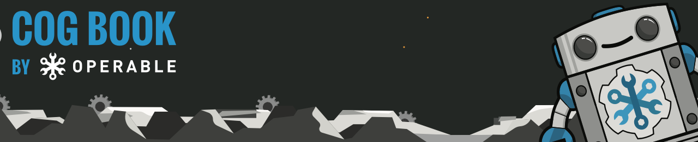

:source-highlighter: pygments
:icons: font
:toc2:
:sectnums:
:linkcss:

:google-analytics-account: UA-61670076-4
:listing-caption: Listing
:figure-caption: Figure

= The Cog Book
:homepage: https://cog-book.operable.io/
:repository: https://github.com/operable/cog-book/[GitHub]
:license: https://github.com/operable/cog-book/blob/master/LICENSE[Apache 2]

NOTE: This book is released under the {license} license. More information about contributing to this book along with access to the source code and previous releases is available at {repository}. If you would prefer to read this book as a PDF, you may download it {homepage}cog_book.pdf[here].

include::src/writing_a_command_bundle/text.adoc[]

// = Reference
// [partintro]
// --
// Here you will find detailed reference information on various aspects of the Cog chat platform.
// --

// == Authorization Rule Syntax
// placeholder

// == Bundle Definition Syntax
// placeholder

// // TODO: Can we somehow import / process the JSON Schema from Spanner in here?

// == Cog Server Configuration
// placeholder

// == Command Environment
// placeholder

// == Command Output Directives
// placeholder

// == Relay Configuration
// placeholder

// == Templating Reference
// placeholder

[colophon]
= Colophon

(C) 2016 by Operable, Inc.

This book is released under the {license} license. Source code is available at {repository}.
